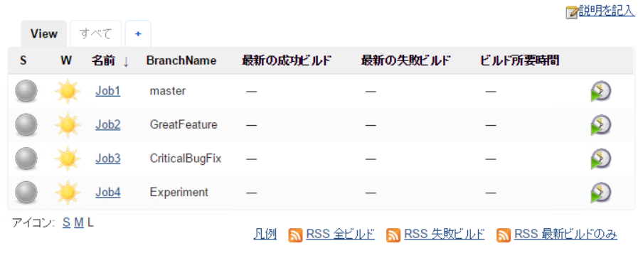

# Jenkins-Plugin-GitBranch-Column
Jenkins plugin for adding git branch name in listvierw

## How to install

Please visit [release page](https://github.com/tanaka-takayoshi/Jenkins-Plugin-GitBranch-Column/releases), download hpi file and install manually.
